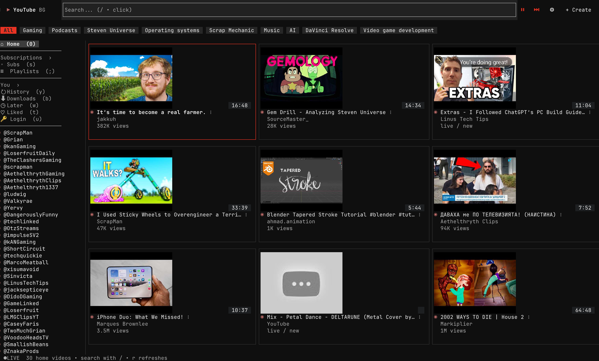
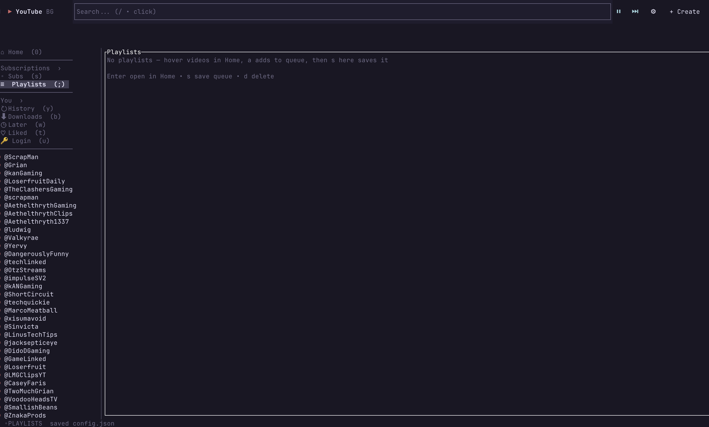
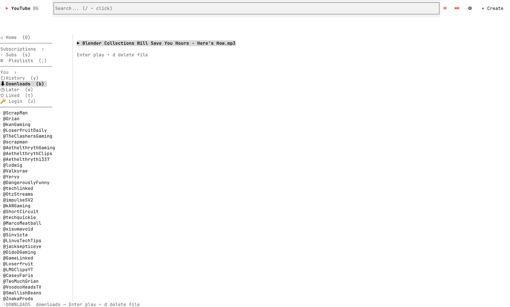

# yt-tui — YouTube in the terminal

No browser. No ads. A single **1.2MB** binary idling at **~15MB RAM** (browser YouTube: 500MB+).


*Home feed (Nord theme) — real Ghostty screenshot with image thumbnails. Click any thumbnail, mouse or keyboard.*

## Why

- **Lightweight** — Rust + ratatui, no webview, no Electron. Works over SSH.
- **Full YouTube layout** — Home and Subscriptions pages, search, playlists, history, Watch Later, comments, queue with autoplay.
- **Mouse-first, keyboard-fast** — click everything; `hjkl` + shortcuts for the rest.
- **Pretty** — real image thumbnails on Kitty/Ghostty/WezTerm (ASCII-art fallback everywhere), **13 themes** in Settings → Style (11 Omarchy + YouTube Dark/Light):


*Same feed, YouTube Dark — 13 themes in Settings → Style.*

## Install

Needs `mpv` + `yt-dlp` (`brew install mpv yt-dlp`).

```bash
cargo install --path .   # then run `yt-tui` from anywhere
# or: download the macOS binary from Releases
```

## Use

`yt-tui` — Home loads on launch. `/` searches, `Enter` plays in mpv (ad-free), `q` quits. Press `?` in-app for all keys.


*Playlists view (Tokyo Night theme) — hover videos in Home, `a` adds to the queue, `s` here saves it as a playlist.*

*Settings (gear icon / `,`) configures everything without touching JSON — click a row for its dropdown, or Enter to cycle. ✕ / [ Close ] / click-outside closes.*

**Login (for likes, subscriptions, Watch Later):** Google blocks terminal passwords, so export `cookies.txt` ( extension while on youtube.com) → Settings → Cookies file → Test login. History, search, and public feeds need no login.


*Downloads view (YouTube Light theme) — `d` on a Home video saves it here, `Enter` plays. Each screenshot here uses a different theme (Midnight / YouTube Dark / Tokyo Night / YouTube Light).*

Right-click (or `x`) any video for like / subscribe / save / download.

## Config

Everything lives in Settings (gear icon / `,`) and persists to `~/.config/yt-tui/config.json`: player (mpv/iina/vlc), quality, themes, feeds, downloads, SponsorBlock, subtitles.

## Security

No shell calls (argv-only subprocesses), video IDs validated at parse, thumbnails sandboxed to the cache dir, titles rendered as plain text, cookies stay in your file. Details in code (`src/engage.rs`, `src/thumb.rs`).

## Dev

```bash
cargo run --release
cargo test
# NOTE: docs/*.png are real terminal captures — do NOT overwrite them with
# the mock pipeline below (it renders offline mock data for layout checks).
cargo run --example shots > /tmp/shots.json && python3 docs/rasterize.py /tmp/shots.json /tmp/mockshots/
```

MIT.
